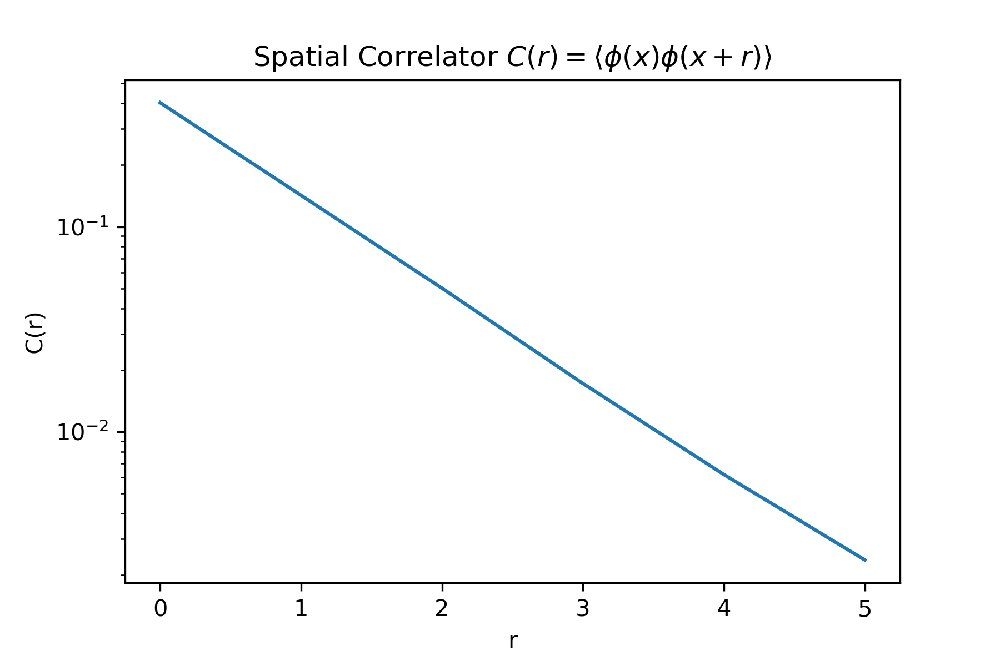
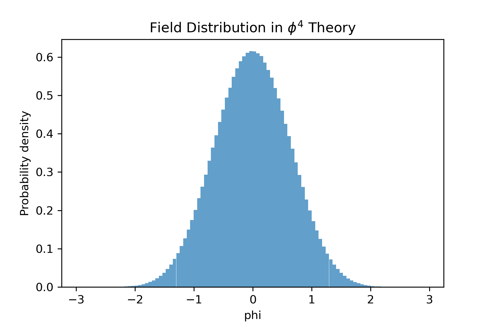
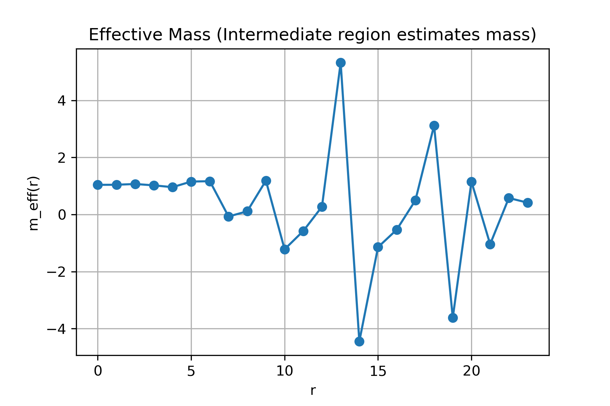
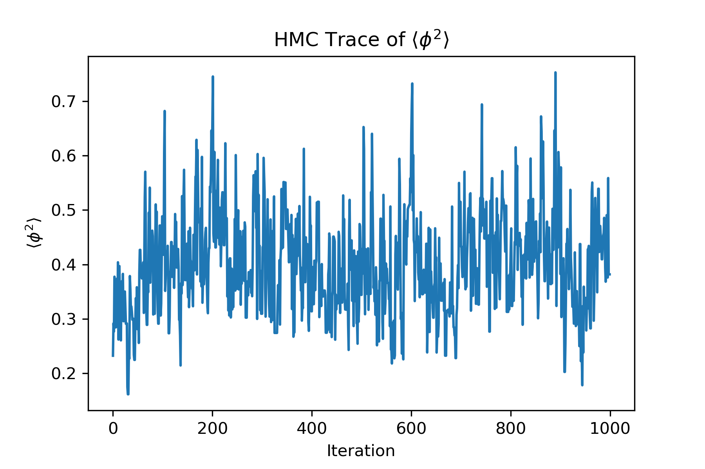

# Python-HMC-Lattice-Phi4-1D
Minimal Python implementation of the Hamiltonian Monte Carlo (HMC) algorithm applied to a 1D lattice scalar $\phi^4$ field theory, demonstrating basic lattice observables and mass extraction from correlation functions.
---

## Overview

This repository implements the Hamiltonian Monte Carlo algorithm for sampling field configurations in a discretized scalar field theory. The system is defined on a one-dimensional lattice with periodic boundary conditions and governed by a $\phi^4$ interaction. The focus is on:
- correctness of the HMC algorithm  
- basic lattice observable construction  
- physical interpretation of correlators  

---

## Model

The Euclidean lattice action is:

$$
S[\phi] = \sum_x \left[ \frac{1}{2}(\phi_{x+1} - \phi_x)^2 + \frac{1}{2}\phi_x^2 + \frac{1}{4!}\phi_x^4 \right]
$$

- Periodic boundary conditions are imposed  
- Units chosen such that:  
  - $m_0^2 = 1$  
  - $\lambda = 1$
  - Lattice spacing set to $a = 1$

---

## Features

- Hamiltonian Monte Carlo using a leapfrog integrator  
- Sampling from $\exp(-S[\phi])$  
- Computation of expectation value $\langle \phi^2 \rangle$  
- Spatial two-point correlator:

$$
C(r) = \langle \phi(x)\phi(x+r) \rangle
$$

- Effective mass estimator:

$$
m_{\text{eff}}(r) = \log\left(\frac{C(r)}{C(r+1)}\right)
$$

- Visualization of:
  - correlator (log scale)
  - field distribution
  - Markov chain trace
  - effective mass

---

## Algorithmic Characteristics

- Uses Hamiltonian dynamics to propose global updates in configuration space  
- Leapfrog integration ensures approximate energy conservation and reversibility  
- Metropolis acceptance step enforces correct equilibrium distribution  
- Avoids diffusive behavior of local-update Monte Carlo methods  

---

## Requirements

- Python 3.x  
- NumPy  
- Matplotlib  

Install dependencies:

```bash
pip install numpy matplotlib
```
---
## Usage

Run:

```bash
python HMC_phi4.py
```

The script will:
- perform HMC sampling  
- compute observables  
- generate plots  
- print expectation values and extracted mass  

---

## Customization

You can modify the model or observables:

- Edit the action in `U(phi)`  
- Modify the gradient in `gradU(phi)`  
- Define new observables via `f(phi)`  

Examples:

```python
def f(phi):
    return 1

def f(phi):
    return np.mean(phi)

def f(phi):
    return np.mean(phi**2)
```

Adjust HMC parameters in `integrate()`:

- `epsilon` $\rightarrow$ step size  
- `L` $\rightarrow$ trajectory length  
- `n_samples` $\rightarrow$ number of samples
- `n_sites` $\rightarrow$ number of lattice sites  

---
## Results (Representative estimate)

```
Expectation: 0.4025167515933189
Acceptance rate: 0.823245
Extracted mass (m_phys): 0.5914833561469833
```

The script also saves the following figures:

```
hmc_phi4_correlation.png
hmc_phi4_hist.png
hmc_phi4_mass.png
hmc_phi4_trace.png
```
  

### Correlator 
- Shows exponential decay consistent with a finite correlation length  

### Effective Mass
- No sharp plateau observed  
- Intermediate region provides an approximate mass scale  

Typical estimate:

$$
m \approx 0.3 \text{–} 0.7
$$

---

## Important Notes

- This is a **minimal implementation** intended to demonstrate core ideas  
- No thermalization, autocorrelation analysis, or error estimation is included  
- Effective mass extraction is qualitative due to statistical noise  

---

## References

- Radford M. Neal,  
  MCMC Using Hamiltonian Dynamics,  
  Handbook of Markov Chain Monte Carlo (2011)  
  https://arxiv.org/abs/1206.1901  

- Peter Arnold and Guy D. Moore,  
  Monte Carlo simulation of O(2) $\phi^4$ field theory in three dimensions  
  https://arxiv.org/abs/0103227  

- Hang Liu *et al.*,  
  $\Xi_c - \Xi_c^0$ mixing from lattice QCD  
  https://arxiv.org/abs/2303.17865  
---

## Scope

This project is intended as a **conceptual demonstration of lattice field theory techniques using HMC**, rather than a production-level lattice simulation.

---

## License

MIT License

## Example Plots

### Spatial Correlator


### Field Distribution Histogram


### Effective Mass


### HMC Trace


